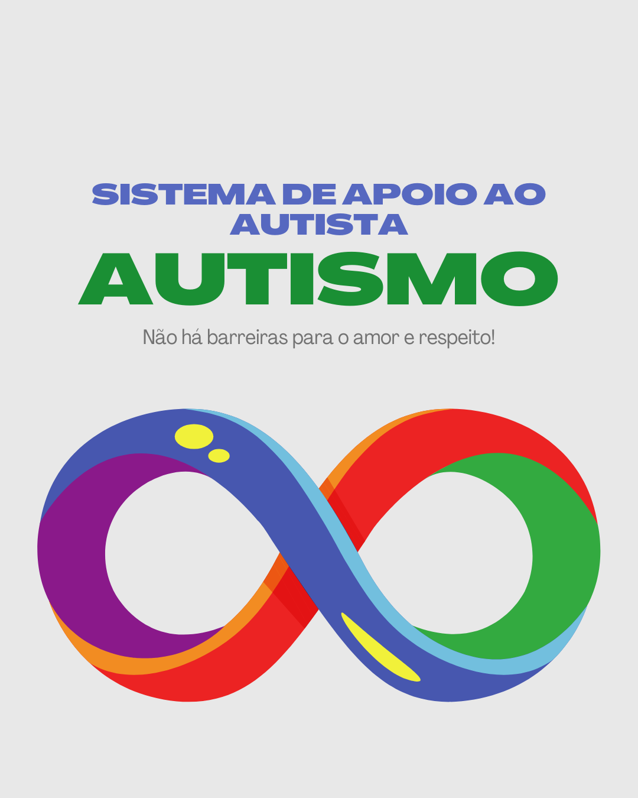

# Sistema de Apoio ao Autista

Sistema criado pra dar apoio às famílias e pessoas no espectro autista a localizar serviços e profissionais próximos de si, bem como, no futuro, incluirá uma gama de variedades de ferramentas para suporte, amparo e apoio ao autista.

O foco inicial de busca é por AT (Assistente Terapêutico), tendo em vista a necessidade constante de autista em todos os níveis e falta de suporte de planos de saúde e clínicas particulares  para atender a estas demandas profissionais, tendo em vista que não há uma regulmentação rígida sobre quem pode exercer esta função, nem mesmo que tipo de formação, resultando em menos profissionais no mercado.

Este projeto está em fase inicial, possui apenas um cadastro para terapeutas e uma interface para busca dos profissionais por estado.

No futuro, permitirá agendamento de consultas, pagamento online, registro de histórico do autista para compartilhamento (com autorização) com os profissionais multidisciplinares que atenderão a pessoa no espectro austista.

O sistema também visa, no futuro, funcionar como uma carteira de regisros da pessoas no espectro autista, para que seja possível lhe facilitar o acesso aos benefícios destinados a este grupo, tudo concentrado em um só lugar.

Também se prevê, que o assistente terapêutico e demais profissionais possam ser avaliados, bem como registrem seu histórico profissional e atualizações.

Especificamente para assistentes terapêuticos, devido a falta de regulamentação rígida, o sistema só permitirá cadastro dos mesmos desde que possuam pelo menos 80h de treinamentos voltado para o conhecimento do espectro autista, sendo validado nos respectivos locais amplamente conhecidos como centro de formação para profissionais que atuam com autistas.

O sistem prevê também, no futuro, incluir neuroatípicos em geral.

Endereço da API: https://github.com/robertsonazevedo/sistema-apoio-tea-api

### 📋 Pré-requisitos

- Possuir um navegador

## ⚙️ Executando os testes

Para testar o sistema em seu navegador, você precisará baixar o repositório do Github do front do sistema-apoio-tea-front, no link: https://github.com/robertsonazevedo/sistema-apoio-tea-front

### 📋 Melhorias Futuras

- Permissão de pesquisa de terapeuta por cidade e bairro.
- Cadastro para outros tipos de profissionais, como psicólogos e médicos.
- Página de login com perfil para cada tipo de usuaário.
- Permissão de agendamento online.
- Pagamento online.

## 🛠️ Construído com

* [HTML](https://developer.mozilla.org/en-US/docs/Web/HTML) - Markup Language para desenvolver os elementos da página.
* [CSS](https://developer.mozilla.org/en-US/docs/Web/CSS) - Usado para estilização do projeto.
* [Javascript](https://devdocs.io/javascript/) - Linguragem de programação usada no Frontend.

## 📌 Versão

Nós usamos [SemVer](http://semver.org/) para controle de versão. Para as versões disponíveis, observe as [tags neste repositório](https://github.com/suas/tags/do/projeto). 

## ✒️ Autores

* **Robertson Azevedo** - *Trabalho Inicial e Documentação* - [robertsonazevedo](https://github.com/robertsonazevedo)
E-mail: azevedo.robertson@gmail.com / contato@techrobertson.com

## 📄 Licença

Este projeto está sob a licença (sua licença) - veja o arquivo [LICENSE.md](https://github.com/usuario/projeto/licenca) para detalhes.

## 🎁 Expressões de gratidão

* Agradecimento ao meu filho Noah, por me inspirar a seguir em frente 📢;

---
⌨️ com ❤️ por [Robertson Azevedo](https://github.com/robertsonazevedo) 😊